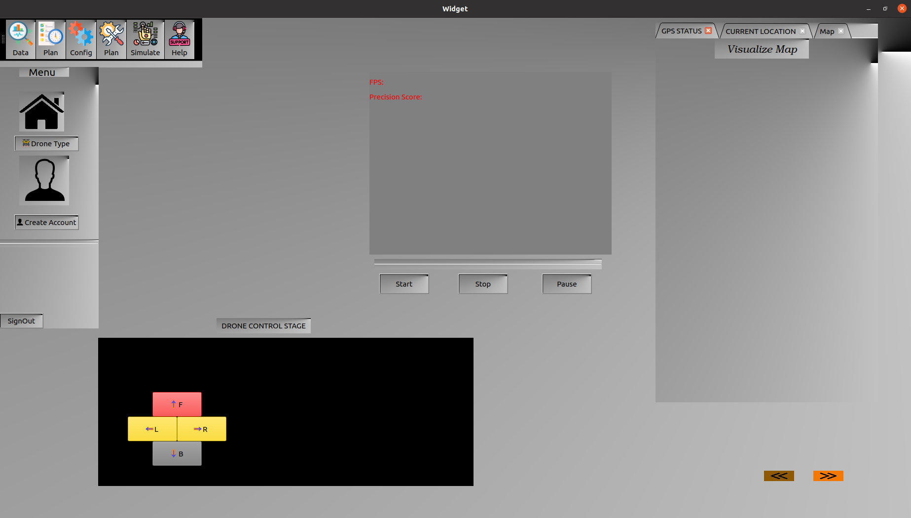
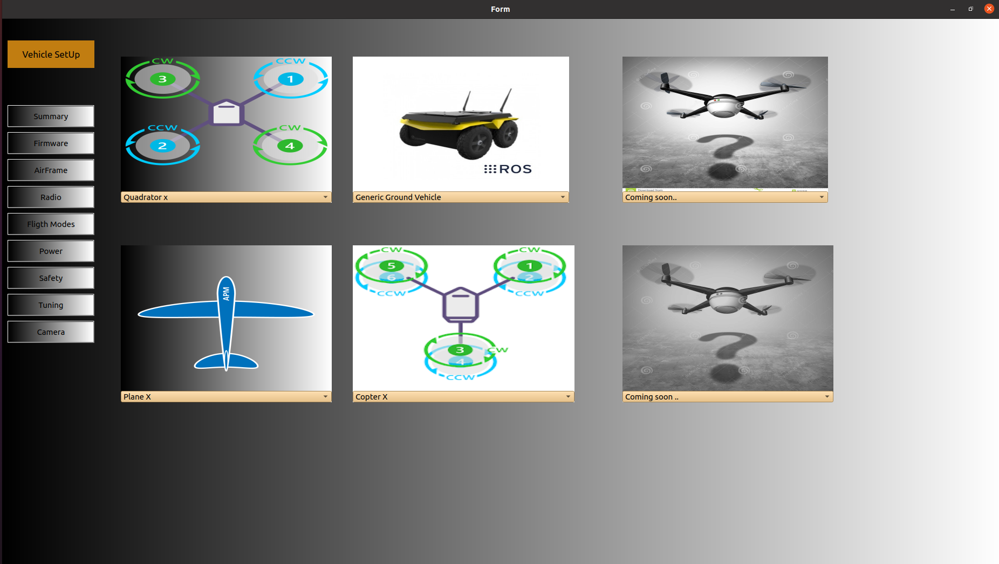
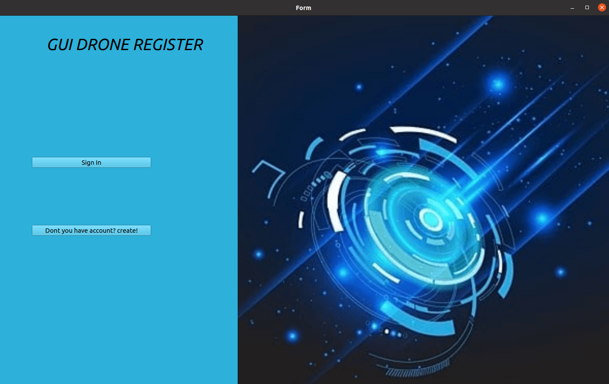
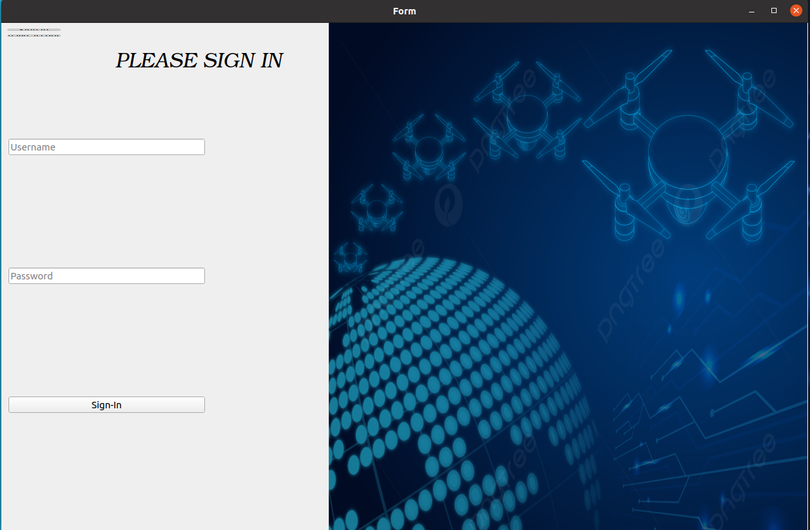
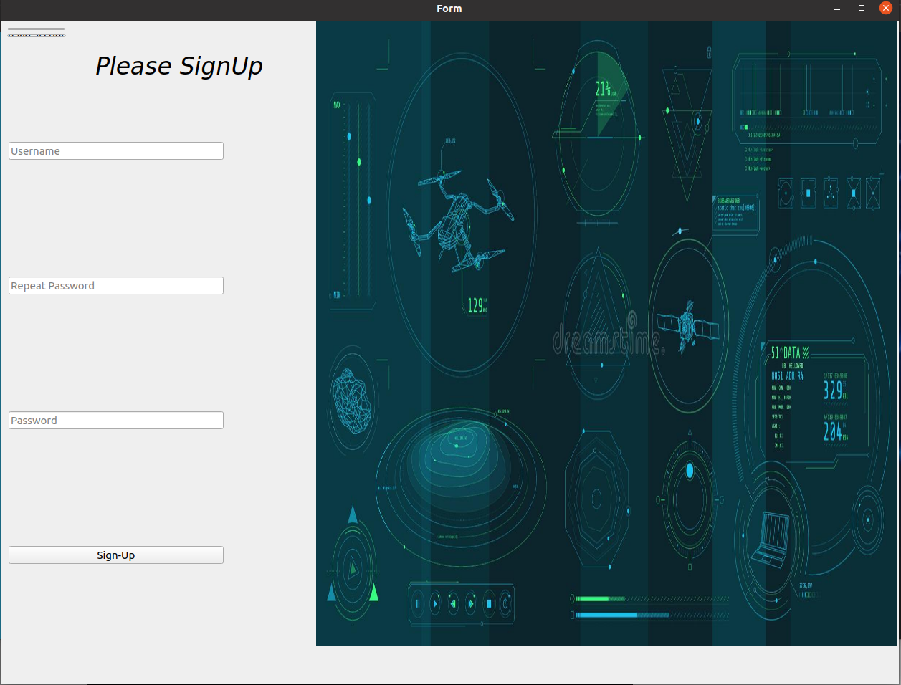

## Questo e' un stazione di controllo e terra software  in grado di controllare vari droni contemporaneamente o individualmente. E Infase di Sviluppo, ha bisogno di ulteriori

```
Per lanciare questo software, bisogno ad aprire qt creator, piuo, entrare su progetto si chiama guiCustom
```
 
 

